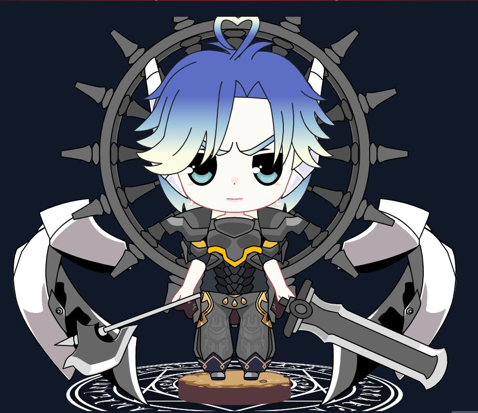

# About HolyKnight's Avatar

General introduction of HolyKnight's Avatar

## 1. What is Avatar?

In the HolyKnight Medieverse, this is the player's Avatar (which can be understood here as a wallet address in the Polygon Network). As a result, each wallet can only hold one avatar at a time (save for the marketplace contract's address), and each Avatar is represented by a unique NFT.

## 2. Main functions of Avatar:

### A. A low-cost player experience in the the HolyKnight Medieverse:

To create a new Avatar during this Avatar Generation Event, the user simply needs to pay one MATIC cost. The Avatar startup charge is equal to the cost of creating a new character in the game once it is released. As a result, Avatar can be utilized to play PvE levels just like a real character, but the Avatar's power and equipment cannot be compared to the real character or the reward earned.

### B. Unlocking Achievements:

Avatar's level is capped at ten in phase one of the game, hence the character's level cap is ten as well. Players will be able to explore additional maps in later levels, implying that this Avatar will be expanded to a higher level. However, the character's level is always constrained by the Avatar's level. Characters with a high level can employ high-level equipment and have access to more lucrative rewards.

### C. Tradeable on the marketplace:

Avatars can be traded on HolyKnight's marketplace or any 3rd-party marketplace that supports NFT (eg OpenSea). Obviously, each wallet can only own 1 Avatar, so don't try to buy more Avatars when you already have 1 NFT Avatar in your wallet.