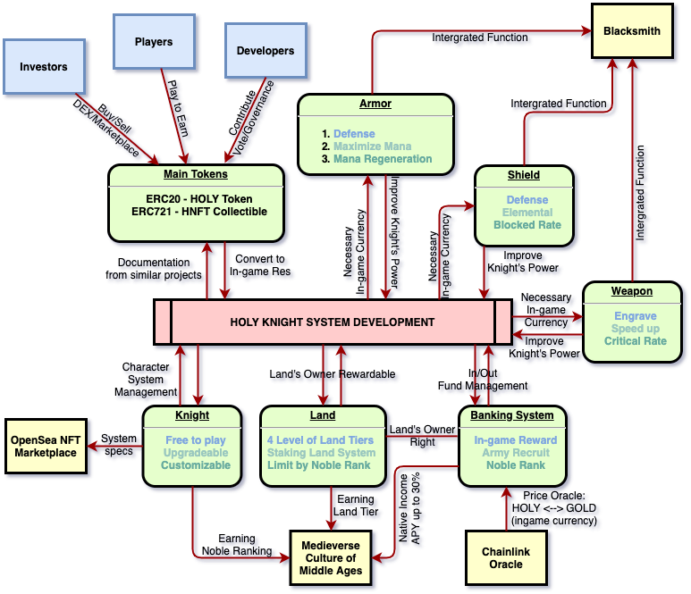

# Start the game

A description of HolyKnight's Character and Equipment concepts.

## Knight (Characters)

Characters are one of the main NFTs the player can possess in HolyKnight. 

Each account can hold a maximum of five characters at any given time.

The price to mint characters is displayed on the button in the Plaza tab.

Each character starts at level one, and comes with a chosen element upon minting.

Players may purchase element change potions from the Marketplace to change the elements of their characters.

### Character Elements

Each character comes as one of five different elements \(Spirit, Fire, Earth, Air, Water\).

Character elements are used to determine advantage calculations and multipliers in combat.

More information on how character elements are used can be found in next artical:



### Character Mana

Each character has their own individual mana pool, with a maximum count of 2400.

Mana regenerates at a rate of two point every minute.

Mana is spent when the player engages in combat, at a rate of 100/200/400/800/1600 mana cost per fight depending on the player's selected mana cost per fight.

This means that in 24 hours, each character can get 2880 mana which equates to 28.8 fights (but it capped maximum by 24).

### Character Hierarchy

Knights can be upgraded in 7 tiers as follows:

Private -> Sergeant -> Lieutenant -> Captain -> Major -> Colonel -> General

More more infomation on how to upgrade can be found here: [Upgrading Character and Items](../)

## Weapons

Each weapon will have its own set of character elements, and the character with that element will be required to utilize a weapon with that element.

The weapon will have the same 5 elements as the character.

Character and weapon upgraded system are very similar.

## Armor
Each armor set will have a different element.

armor will have the same 5 elements.

armor whose strength is reduced resistance. strengthen defense.

armor helps increase the character's defense

## Shield
shields have the same 5 elements as armor.

Shields help strengthen defense and increase the ability to dodge attacks from the opponent

shields increase the character's defense

## Blacksmith

### Upgrade

### Reforge

### Engrave

## Land

## Banking System

